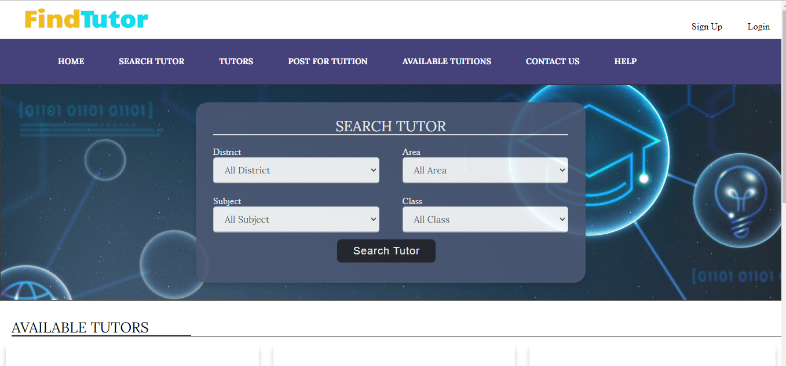
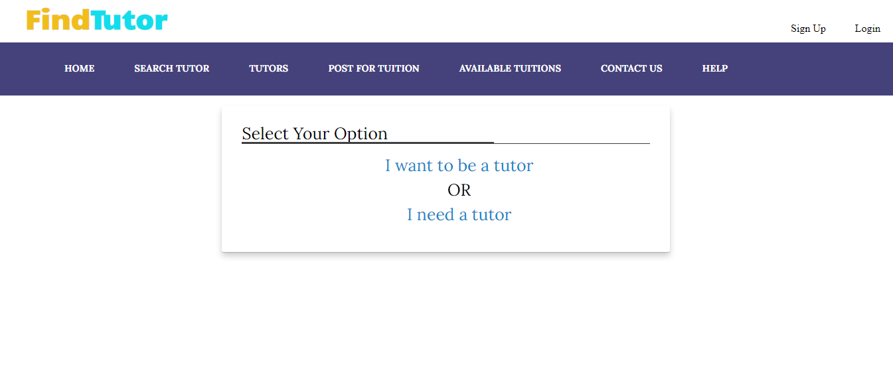
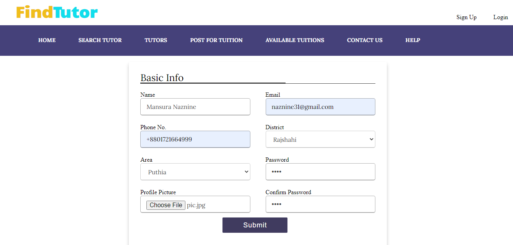
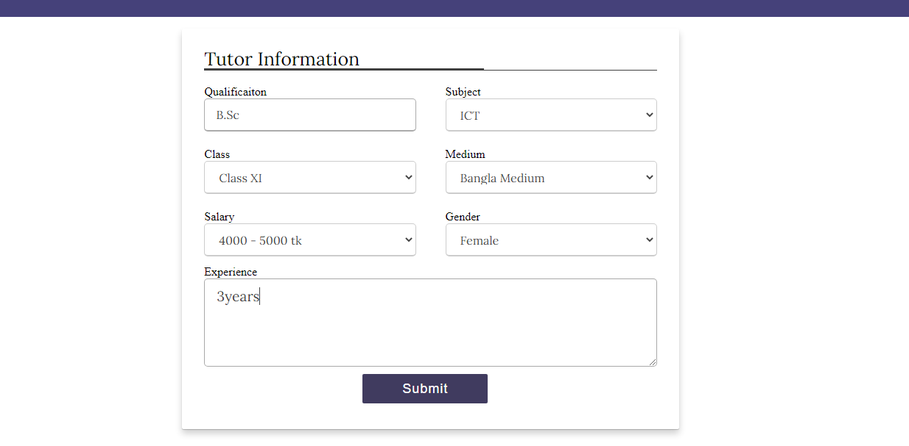
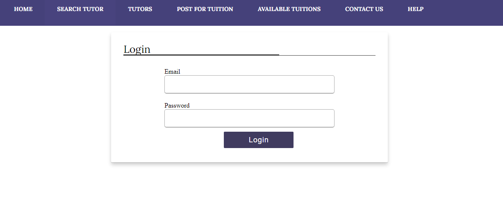
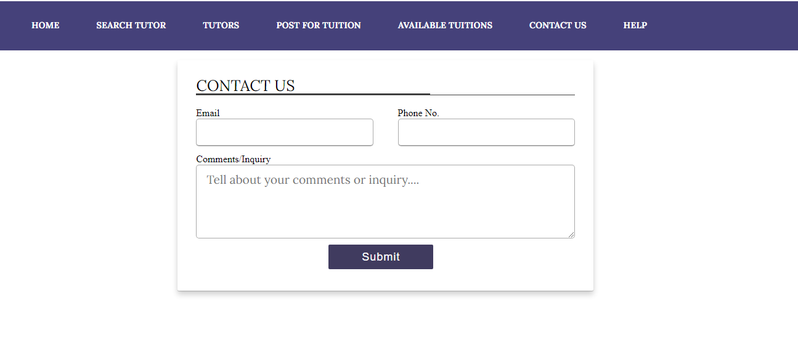
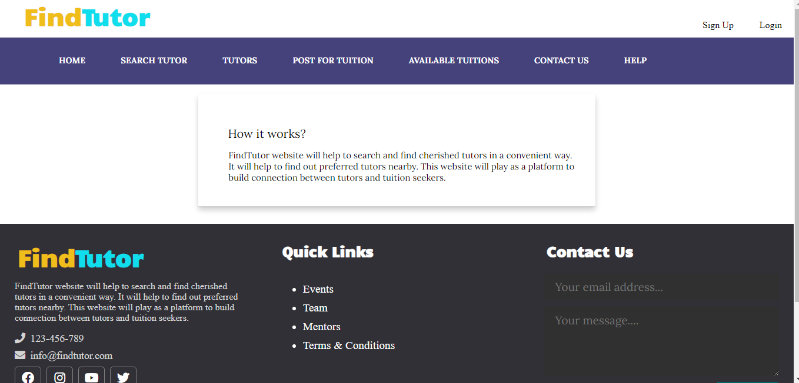

# Find-Tutor-CSE-3100-

**Find Tutor Website:**

**Cloud hosting link:**
http://findtutor.unaux.com/

The purpose of this website is to assist the students/guardians to find private tutors in an 
interactive manner. It will also help tutors to find full time and part time teaching jobs.

With this website:
1. Guardians/students can find tutors as per their requirements easily.
2. This website can also be used by many students who love teaching as a part time job.

Overview:
This application will have two main sections:
  1. For Students (who needs tutor):
    * Sign up.
    * Log in.
    * Send requirements for teachers.
    * Get recommendation according to requirements.
  2. For Tutors (who needs tuition):
    * Sign up.
    * Log in.
    * Creating profile as a tutor.
    * Get recommendation of any available job.

**Installation Guide:**
1. Download the repository from github.
  If you have git write git clone https://github.com/naznine/Find-Tutor-CSE-3100-.git opening cmd from the project directory.
  Otherwise just download the repository normally.
2. Download Xampp, Visual Studio Code or any other text editor.
3. Start Apache,Mysql in Xampp.
4. Import find_tutor.sql file in Xampp.
5. Write localhost/findtutor.php in browser.

How the website looks like:

**Installation Guide:**
1. Download the repository from github.
  If you have git write git clone https://github.com/naznine/Find-Tutor-CSE-3100-.git opening cmd from the project directory.
  Otherwise just download the repository normally.
2. Download Xampp, Visual Studio Code or any other text editor.
3. Start Apache,Mysql in Xampp.
4. Import find_tutor.sql file in Xampp.
5. Write localhost/findtutor.php in browser.

